# ChemKAN reproduction — figure-by-figure summary

One page covering every reproducible and comparable result in
[Koenig, Kim & Deng 2025, *PCCP* **27**, 17313](https://doi.org/10.1039/D5CP02009C), with the figure we
produced beside the paper's claim. Every number below is read from a committed artifact,
and the artifact path is given so each row can be checked.

**"Evaluated" is not "matched."** Figures 3–8 and Table I have all been evaluated end to
end. Most of the paper's reported *numbers* are not reproduced. Section 4 separates the
evidence that the *implementation* is correct from the question of whether it *matches the
paper*, because those are different claims with different support.

Row-by-row verdicts:
[`reproduction_comparison.csv`](../results/reproduction/tables/reproduction_comparison.csv)
(20 rows) · full evidence: notebooks
[07](../chemkan/notebooks/07_biodiesel_reproduction.ipynb) and
[08](../chemkan/notebooks/08_hydrogen_reproduction.ipynb).

---

## 1. Scoreboard

| paper result | our result | verdict |
|---|---|---|
| Fig. 3 — reconstruction at 0/5/10/15 % noise | all four columns, all six species, at the paper's explicit unseen condition | qualitatively similar, not quantitatively matched |
| Fig. 4 — ChemKAN slopes −1.0 / −0.6 | −0.41 / −0.38 (R² 0.19 / 0.18) | fitting scope differs |
| Fig. 4 — DeepONet slopes −4.0 / −1.4 | −2.08 / −1.32 (R² 0.68 / 0.76) | fitting scope differs |
| Fig. 5A — ChemKAN clean-test error grows ~2× over 0→15 % | 0.77× (does not grow) | not matched |
| Fig. 5A — DeepONet/ChemKAN clean-test ratio 4.4× at 15 % | 0.86× | not matched |
| Fig. 5B — DeepONet overfits at 7 % and 15 %, ChemKAN does not | no run meets our criterion, in either direction | does not discriminate |
| Fig. 6 — 15 % models track the hidden clean trajectory | both models plotted at Fig. 3's condition | evaluated; plotted condition is our choice |
| Fig. 7 — one 344-parameter ChemKAN reconstructs 9 species + T | species reconstructed by both runs; `H0` does not ignite (T is 89–95 % of its loss), `Hnorm1` does | not matched (`H0`) |
| Fig. 8A — ~10⁻⁴ at the 1000 K training points | 1.50–2.31 (`H0`), 0.50–0.95 (`Hnorm1`) | not matched |
| Fig. 8B — close ignition-delay agreement over 30 conditions | `H0` 0/30; `Hnorm1` 30/30, median rel. error 28.9 % | not matched (`H0`) |
| Table I — 1 network, 344 parameters, 9 species + T | 1 / 344 measured / 9 + T | **matched** |
| Table I — 2.0× speed-up vs Arrhenius.jl | 0.14× (`H0`), 0.50× (`Hnorm1`) vs Cantera, locally | not matched; different reference and hardware |

---

## 2. Biodiesel (Sec. III A)

### Figure 3 — trajectory reconstruction under noise

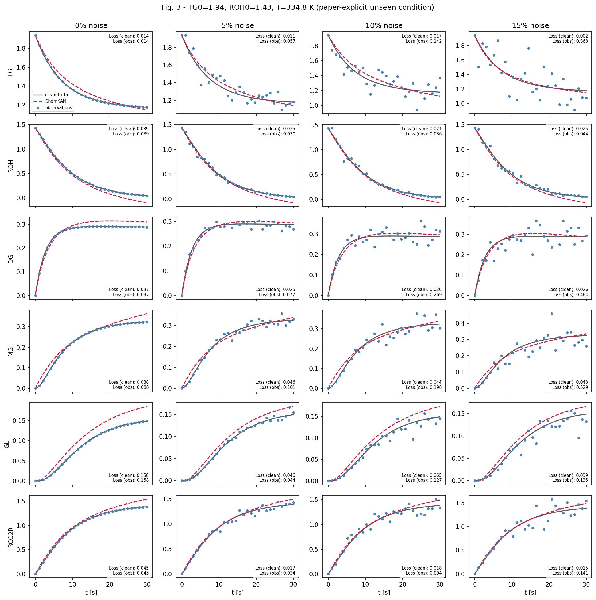

Paper: a 156-parameter ChemKAN reconstructs all six species from sparse noisy data.
Ours: the architecture matches exactly (`P = 39h` at `h=4`, N=3, base OFF — measured from
`model.parameters()`), and the shape is right at every noise level. The reconstruction is
visibly imperfect even at 0 %: ROH is driven negative at late times, GL and R'CO₂R
overshoot. The noisy columns are not visibly worse than the clean one.

### Figure 4 — neural scaling

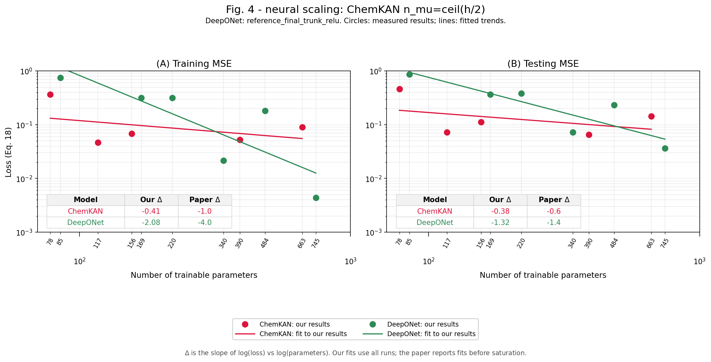

Widths span the parameter range of the paper's Figure 4 axis
([`fig4_width_matrix.md`](fig4_width_matrix.md)). The paper gives no width table, so they
are not paper-specified architectures.

| series | paper | ours (all-point) | R² |
|---|---|---|---|
| ChemKAN train | −1.0 | −0.41 | 0.19 |
| ChemKAN test | −0.6 | −0.38 | 0.18 |
| DeepONet train | −4.0 | −2.08 | 0.68 |
| DeepONet test | −1.4 | −1.32 | 0.76 |

Ours are **descriptive regressions over every measured point**; the paper fits a
pre-saturation subset. The ChemKAN R² of ~0.19 means the fitted line explains almost none
of the variance — the slope is reported, not relied on.
[`biodiesel_fig4_fits.csv`](../results/reproduction/tables/biodiesel_fig4_fits.csv)

A second sweep at fixed `n_mu = 2` gives **positive** slopes (+0.69 / +0.68, R² 0.88 /
0.87): in that sweep, increasing width did not improve loss.
[`..._nmu2.csv`](../results/reproduction/tables/biodiesel_fig4_fits_nmu2.csv)

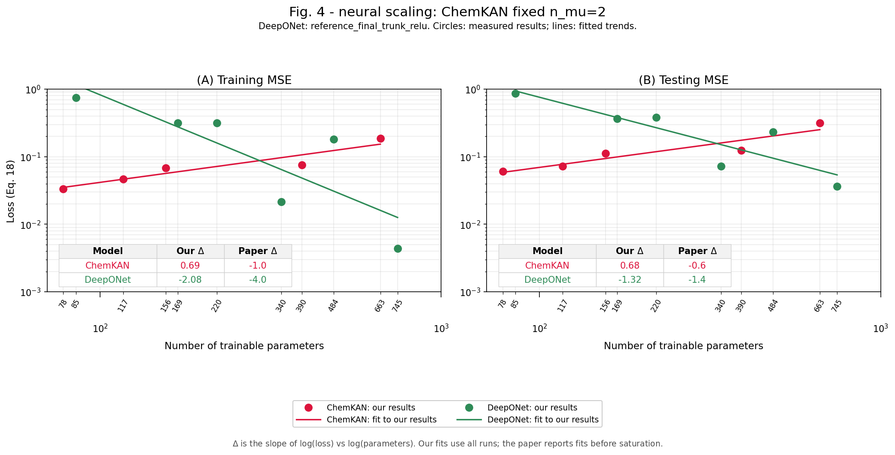

### Figure 5A — noise robustness

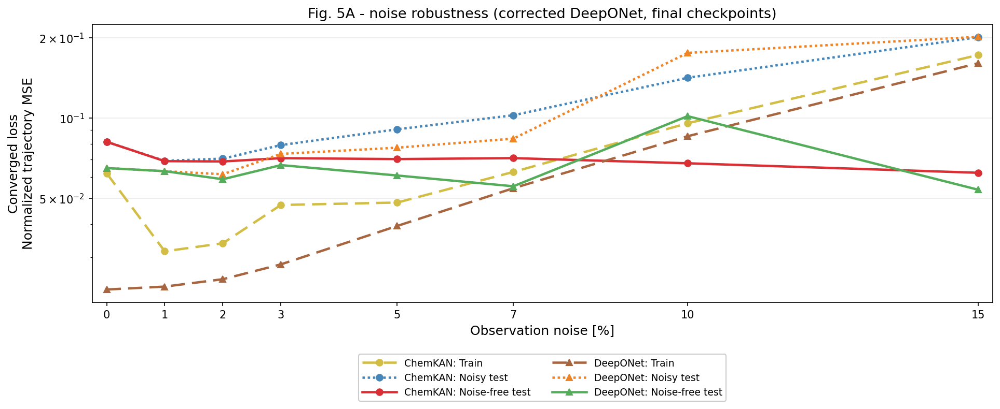

The paper's central claim is that ChemKAN's noise-free (Eq. 22) test error degrades
gracefully while DeepONet's degrades ~5×. Ours does not reproduce the trend in either
model: over 0→15 % noise, ChemKAN's clean-test error goes to **0.77×** and DeepONet's to
**0.83×** — both flat to slightly *lower*, not higher.
[`biodiesel_fig5a_metrics.csv`](../results/reproduction/tables/biodiesel_fig5a_metrics.csv)

The paper's small training-loss *increments* (+3.78×10⁻⁵ at 0→1 %) come out **negative**
for us (−3.04×10⁻²). Both endpoints are single fixed checkpoints, and `B0`'s training loss
spans 0.088 over its final 200 epochs — larger than the increment being compared. The sign
is set by where each run's 10,000th epoch lands in its own oscillation, so this row is not
currently measurable at the precision the comparison needs.

### Figure 5B — loss dynamics

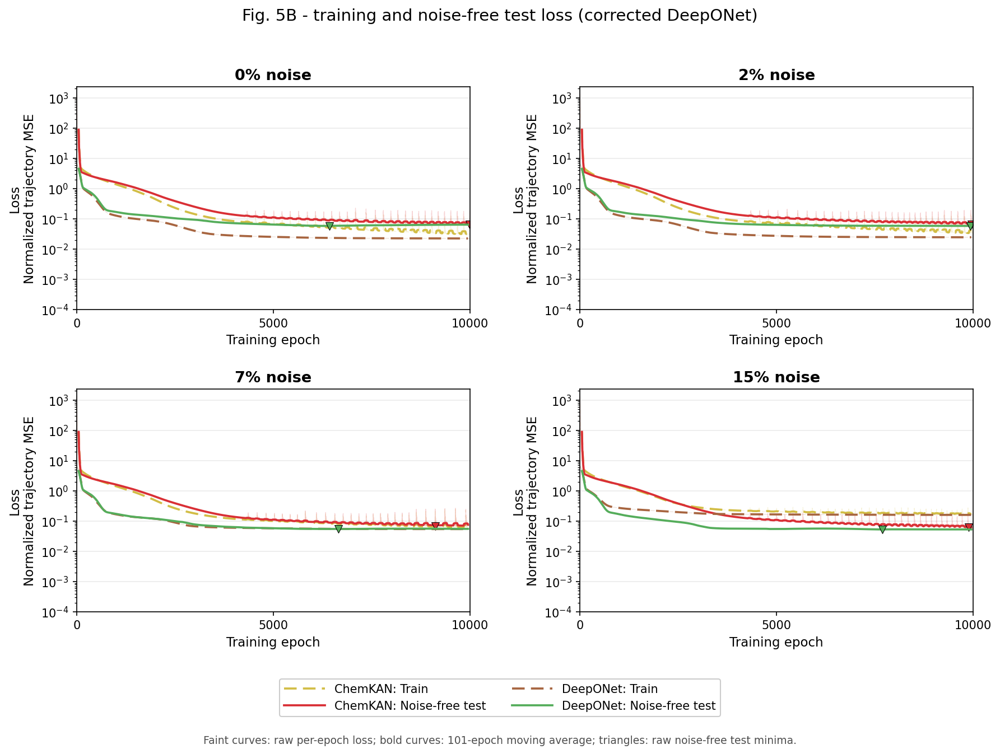

**No run meets our overfitting criterion**, ChemKAN or DeepONet. The paper's DeepONet 7 %
minimum near epoch 5000 appears in ours at epoch 6659, but the subsequent clean-test rise
is 1.2 % while the smoothed training loss also *falls* 1.8 % — which is not the two-curve
signature of overfitting. The 10 %/5 % thresholds, 201-epoch smoothing window and 90 %
cutoff are **our diagnostic choices, not paper requirements**, and absence of the
signature is not proof of no overfitting.
[`biodiesel_fig5b_overfit_assessment.json`](../results/reproduction/tables/biodiesel_fig5b_overfit_assessment.json)

The 0 % ChemKAN panel comes from a clean replay that reproduces `B0` **bitwise** (see §4);
`B0` remains the established 0 % result for Figs. 3 and 5A.

### Figure 6 — 15 % noise profiles

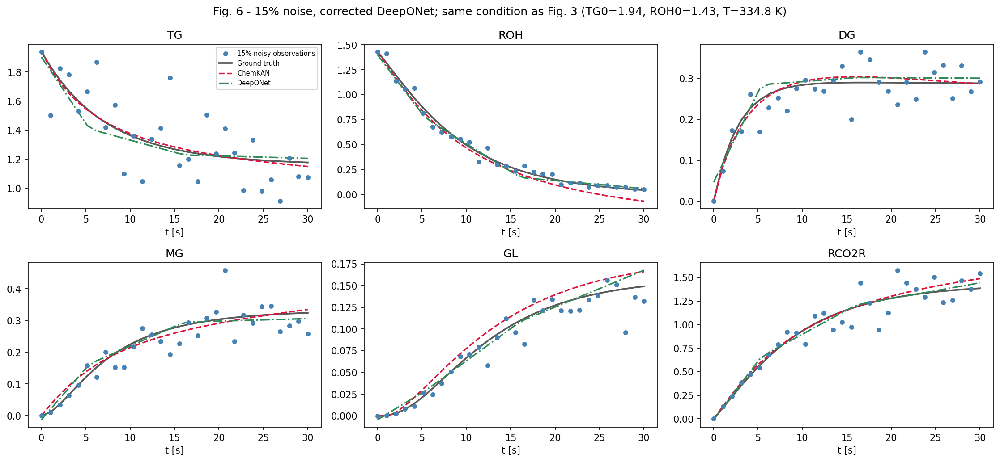

Both 15 %-noise models track the hidden clean trajectory, with clean MSE 0.0257 (ChemKAN)
and 0.0262 (DeepONet) — near-identical, where the paper describes the DeepONet profiles as
visibly jagged. We plot **Figure 3's published condition**, which is unseen and therefore
directly comparable to Fig. 3; the paper plots an unidentified training trajectory. That
choice is ours and is labelled as such.
[`biodiesel_fig6_profile_metrics.json`](../results/reproduction/tables/biodiesel_fig6_profile_metrics.json)

---

## 3. Hydrogen (Sec. III B)

Two runs are reported throughout: **`H0`**, the primary attempt (N=4 / base-ON, 344
parameters, random thermo init), and **`Hnorm1`**, a separately labelled norm-matched
initialization. `H0` fails and is kept as the primary result including its failure.
`Hnorm1` does much better — but it is **one initialization, not a seed study**, and it
does not establish a cause.

### Figure 7 — reconstruction at the two published conditions

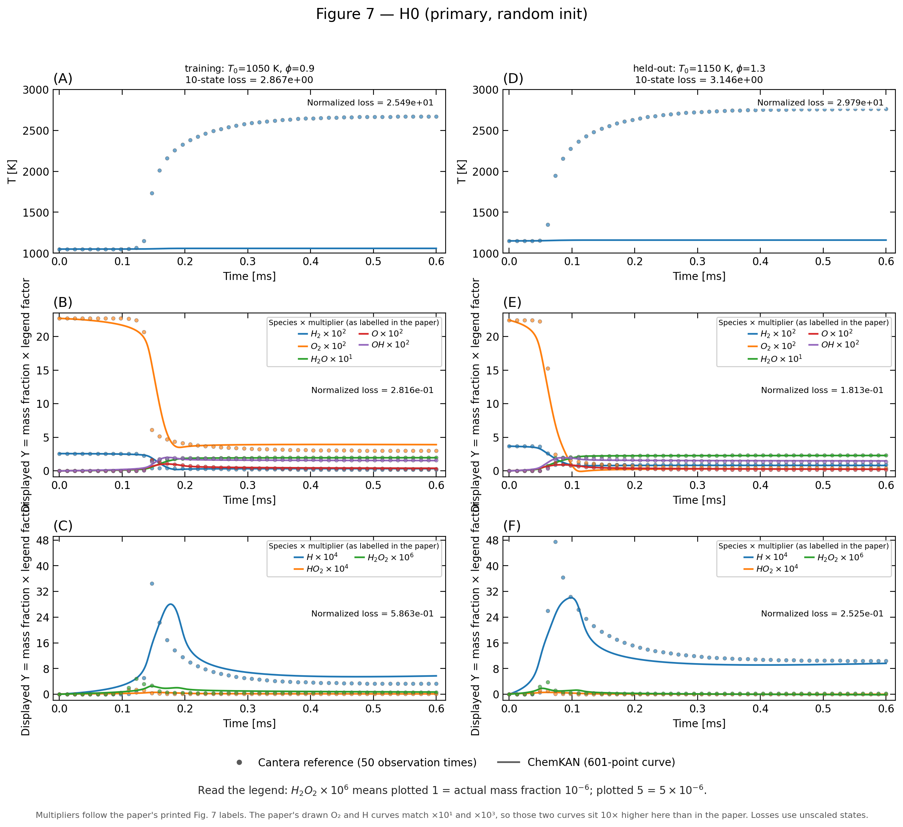

**Temperature dominates `H0`'s error; its kinetic accuracy remains imperfect.** Panels
(A) and (D) show the prediction flat at `T₀` while the reference climbs past 2500 K — no
ignition at either condition. Panels (B), (C), (E) and (F) show the species genuinely
reacting and broadly tracking the reference: H₂ falls, H₂O rises, OH peaks. Numerically,
temperature is **88.9 %** of the ten-state loss at the training condition and **94.7 %** at
the held-out one, against a nine-species mean of 0.352 and 0.186.

That makes the failure lopsided, not selective. The species are far **less** wrong than
temperature, but they are not accurate: 0.186–0.352 summed over the 50 observation times is
0.0037–0.0070 time-averaged, still roughly **37–70× above** the paper's ~10⁻⁴ order. So
calling `H0` a blanket failure misreads the figure, and calling it a kinetics success
overstates it.

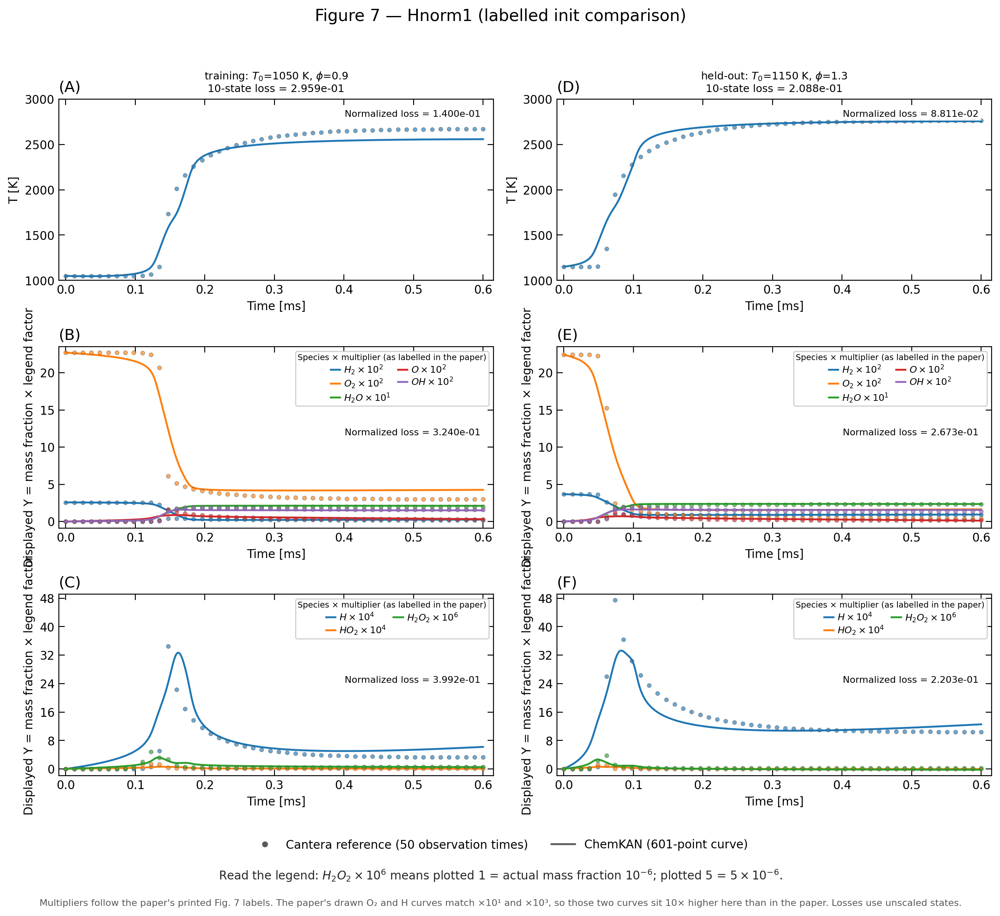

**`Hnorm1`'s advantage is predominantly temperature.** Its ten-state loss is far lower
(0.296 / 0.209 against `H0`'s 2.867 / 3.146), and temperature accounts for **98.6 %** of
that improvement at the training condition and for **all** of it at the held-out condition,
where the species in aggregate get worse:

| | `H0` | `Hnorm1` | |
|---|---|---|---|
| T MSE, training | 25.494 | 0.140 | **182× better** |
| T MSE, held-out | 29.787 | 0.088 | **338× better** |
| 9-species mean, training | 0.352 | 0.313 | ~unchanged |
| 9-species mean, held-out | 0.186 | **0.222** | **`H0` is better** |

At the held-out condition `Hnorm1` is worse than `H0` on **six of nine species** (H₂, O,
O₂, OH, H₂O, H₂O₂); at the training condition its species mean is slightly better, so the
gain is not purely thermal. The norm-matched initialization largely recovers the
thermodynamic path while leaving the kinetics roughly where they were, and on unseen data
it trades a little species accuracy for a large temperature gain. That is one
initialization, not a seed study, and it does not establish a cause.
[`fig07_hydrogen_per_state_mse.csv`](../results/reproduction/tables/fig07_hydrogen_per_state_mse.csv)

**Two distinct mismatches live in this figure and must not be merged.**

1. **Display annotation.** Two of the paper's printed multipliers do not agree with our
   reference values at its own plotted scale: our initial O₂ mass fraction is 0.2270, so
   ×10² would place the curve at 22.70 while the paper draws it near 2.27; our sampled H
   peak is 0.003453, so ×10⁴ would give 34.53 against a plotted peak near 3.5. We display
   **O₂ ×10¹ and H ×10³** instead, labelled in-figure. This is a display choice to obtain
   comparable panel ranges, **not** a claim that the paper printed those factors — without
   the authors' plotting code a typo cannot be confirmed. No data, prediction or loss is
   affected: losses are computed before any multiplier.
2. **Prediction accuracy.** The models genuinely differ from the reference, and the two
   runs differ in where the error sits: `H0` overwhelmingly in the thermodynamic path,
   `Hnorm1` mostly in the kinetics it did not improve. Neither is accurate on the species.
   The cause of the remaining gap is **unresolved**, and FSA has not been tested.

A companion view plots the identical data at **true mass fraction with no multipliers**,
on a symlog axis. It shows what the multiplier view hides — predicted mass fractions going
negative at the held-out condition (`H0`: O₂, HO₂, H₂O₂; `Hnorm1`: HO₂, H₂O₂):

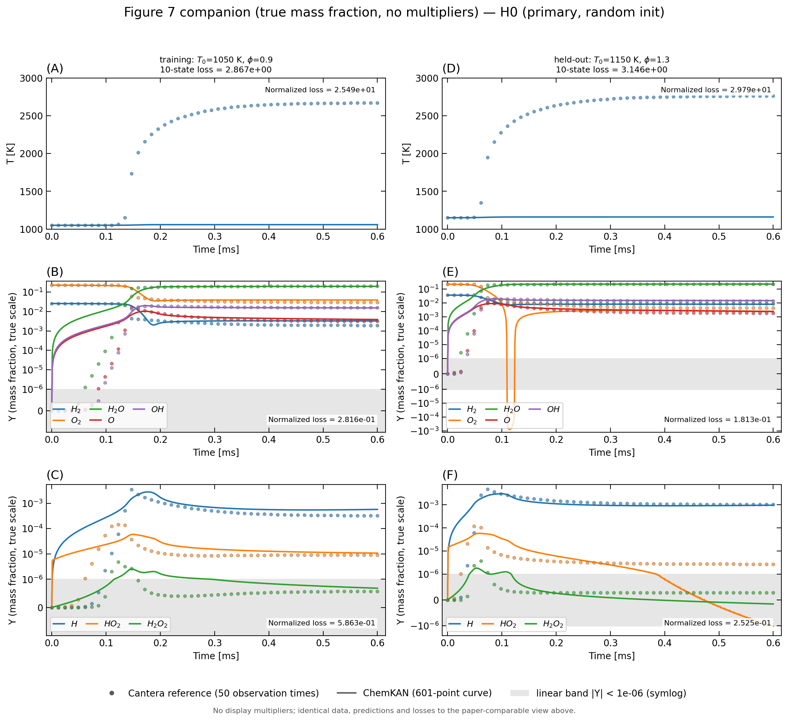

*(`H0` shown; the `Hnorm1` companion is
[`fig07_hydrogen_trajectories_Hnorm1_true_scale.png`](../results/reproduction/figures/hydrogen/fig07_hydrogen_trajectories_Hnorm1_true_scale.png).)*

### Figure 8A — 441-condition generalization

Shown at the paper's displayed **0–10 ×10⁻⁴** range, smaller MSE darker. Every one of the
441 errors exceeds that upper bound for both models, so this view is uniformly pale — that
saturation *is* the result, and no error was rescaled to fit:

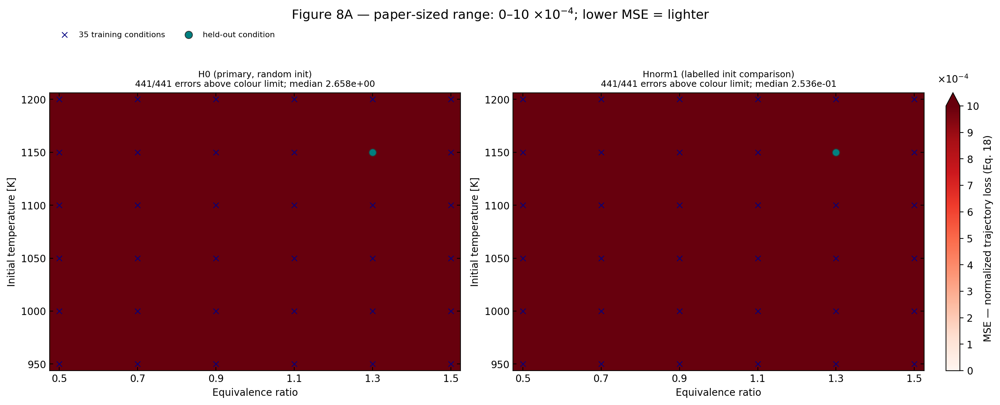

The full-range view reveals the spatial structure:

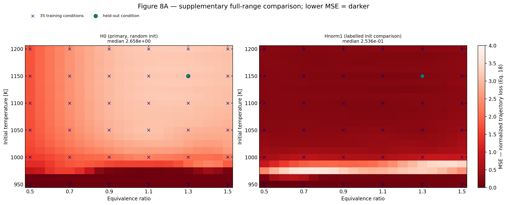

| | paper | `H0` | `Hnorm1` |
|---|---|---|---|
| six 1000 K training points | order 10⁻⁴ | 1.50–2.31 | 0.50–0.95 |
| 21 unseen points at 987.5 K | order 10⁻³ | 1.30–2.30 | 0.93–3.47 |
| 441-grid median | not reported | 2.658 | 0.254 |

All 441 conditions were evaluated with **0 integration failures**. The 21×21 grid is
reconstructed from the paper's reported count and figure spacing. Absolute magnitudes
carry the unresolved time-reduction caveat (§5).

### Figure 8B — ignition delay

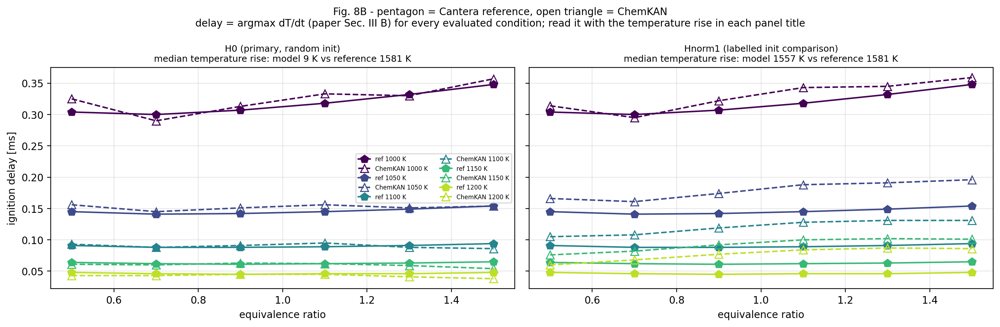

Reference and model share one 601-point grid and one estimator (`argmax dT/dt`), so the
comparison is like-for-like. `H0` ignites in **0 of 30** reference-igniting conditions.
`Hnorm1` ignites in **30/30**, median absolute relative delay error **28.9 %**, and also
ignites in **2** conditions where the reference does not.

### Table I — efficiency

| | networks | parameters | states | speed-up |
|---|---|---|---|---|
| ChemNODE (Ref. 17) | 7 | 637 | 6 species + T | 2.3× |
| ChemKAN (paper) | 1 | 344 | 9 species + T | 2.0× |
| `H0` (local) | 1 | **344 measured** | 9 species + T | 0.14× |
| `Hnorm1` (local) | 1 | **344 measured** | 9 species + T | 0.50× |

Counts match exactly. The speed-up does not: both local measurements are **slower** than
Cantera. This is a PyTorch-vs-Cantera measurement on different hardware with a different
timing scope, so it is **not directly comparable** to the paper's Arrhenius.jl figure and
the two are reported side by side rather than merged. Cantera could not integrate at the
model's own tolerances, so results are recorded per tolerance setting.
[`hydrogen_efficiency.csv`](../results/reproduction/tables/hydrogen_efficiency.csv)

---

## 4. Evidence the implementation itself is correct

These checks are independent of whether the paper's numbers are matched. They test the
code, not the science.

| check | result |
|---|---|
| Biodiesel parameter count | **156**, measured from `model.parameters()`, exactly `39h` at `h=4` — the paper's stated architecture |
| Hydrogen parameter count | **344** measured, matching Table I exactly |
| Clean replay vs `B0` | **bitwise identical** — identical weights and identical training loss at all 10,000 epochs; the replay only adds the per-epoch clean-test columns `B0` lacks |
| Fig.-4 `h=4` snapshot | the epoch-5000 snapshot is **bitwise identical** to an independently trained 5,000-epoch run |
| Determinism | training is bitwise reproducible under CPU contention (200 epochs × 4 parallel columns, identical) |
| Run provenance | 19 audited checkpoint references — 8 DeepONet noise, 6 DeepONet scaling, 5 ChemKAN scaling — each verified by SHA-256 against its checkpoint. Only the 11 scaling rows are Figure-4 points. ([`biodiesel_completed_run_audit.csv`](../results/reproduction/tables/biodiesel_completed_run_audit.csv)) |
| Test suite | **235 passing** |

---

## 5. Open items and known caveats

- **The absolute MSE gap is unexplained.** Our literal Eq. 18 values are train 0.062 /
  test 0.081; the conventional time-averaged equivalents are 2.07×10⁻³ / 2.71×10⁻³. The
  paper does not state its time reduction. Dividing by `N_t = 30` accounts for exactly one
  factor of 30, and the residual gaps after that still span 2×–1400× across Fig.-4 points
  — so a reduction convention **cannot** be the explanation, and no figure is replotted in
  those units.
- **`B0` has not converged at the paper's own 10,000-epoch cutoff.** Its median training
  loss still falls at 0.049 decades per 1000 epochs over the last 3000 epochs.
- **ChemKAN's late-training oscillation is unresolved.** Its late-training loss span is
  0.1045–0.1894 across the plotted runs, against DeepONet's 0.000346–0.001075 — two to
  three orders of magnitude larger. The presence of oscillation alone does not establish
  an ODE-solver cause, and none is claimed.
- **DeepONet is 340 measured parameters against the paper's reported 308.** No
  architecture was selected to close that gap.
- **DeepONet activation placement is reference-derived, not paper-stated.** Reported runs
  use `reference_final_trunk_relu`; the earlier `legacy_final_trunk_linear` checkpoints and
  their labelled reports are retained.
- **FSA is not implemented.** All runs use direct autograd. No result here speaks to
  whether Forward Sensitivity Analysis would change any outcome. This is the largest
  paper-explicit missing method and is a separate task.
- **The hydrogen failure has no single established cause.** Grid size `N`, the `θ_thermo`
  initialization and any derivative scaling inside Eq. 14 are all unstated in the paper, so
  several explanations remain simultaneously open. Diagnostics:
  [notebook 09](../chemkan/notebooks/09_hydrogen_thermo_failure_analysis.ipynb).

## 6. Consolidated biodiesel training comparison

The table below brings together the saved full-batch, observed-interval, and trajectory
batch-size-1 experiments. The **full-rollout train/test MSE** columns are the comparable
metrics: the model is integrated from the original initial conditions over the complete
time grid, without injecting observations between time points. The **local objective** is
shown only for observed-interval training; it restarts from an observed state at every
interval and therefore must not be compared directly with the full-rollout MSE columns.

| procedure | seed | epochs | optimizer updates | local objective | full-rollout train MSE | held-out test MSE | runtime (s) |
|---|---:|---:|---:|---:|---:|---:|---:|
| Original full batch (`B=20`) | 0 | 10,000 | 10,000 | — | 0.062017 | 0.081401 | 628.1 |
| Original full batch (`B=20`) | 1 | 10,000 | 10,000 | — | 0.022466 | 0.063242 | 1,072.6 |
| Original full batch (`B=20`) | 2 | 10,000 | 10,000 | — | 0.033120 | 0.055667 | 1,084.6 |
| RBF-labelled full batch (`B=20`) | 0 | 10,000 | 10,000 | — | 0.014882 | 0.038514 | 649.4 |
| Observed intervals | 0 | 10,000 | 10,000 | 0.000245 | 0.032555 | 0.085017 | 5,493.2 |
| Observed intervals | 1 | 10,000 | 10,000 | 0.000389 | 0.023246 | 0.067326 | 6,768.6 |
| Observed intervals | 2 | 10,000 | 10,000 | 0.000205 | 0.018138 | 0.070551 | 6,528.6 |
| Full rollout, batch size 1 — matched budget | 0 | 500 | 10,000 | — | 0.117750 | 0.131032 | — |
| Full rollout, batch size 1 — full budget | 0 | 10,000 | 200,000 | — | 0.021087 | 0.035169 | 28,353.2 |

The observed-interval rows use one optimizer update per epoch, although they perform 29
interval integrations per update. Batch size 1 uses 20 optimizer updates per epoch, so its
10,000-epoch run receives 200,000 updates. At the matched 10,000-update budget, batch size
1 performs worse than the original full-batch run; its improvement appears only after the
additional 20-fold update budget.

Sources: observed-interval [final comparison](../results/experiments/biodiesel_observed_intervals/tables/observed_intervals_final_comparison.csv),
[runtime table](../results/experiments/biodiesel_observed_intervals/tables/observed_intervals_runtime.csv),
batching [final comparison](../results/experiments/biodiesel_trajectory_batching/tables/batching_final_comparison.csv),
and the RBF-labelled run's [metrics](../results/experiments/biodiesel_rbf_kanode/clean_seed0/metrics.json).
